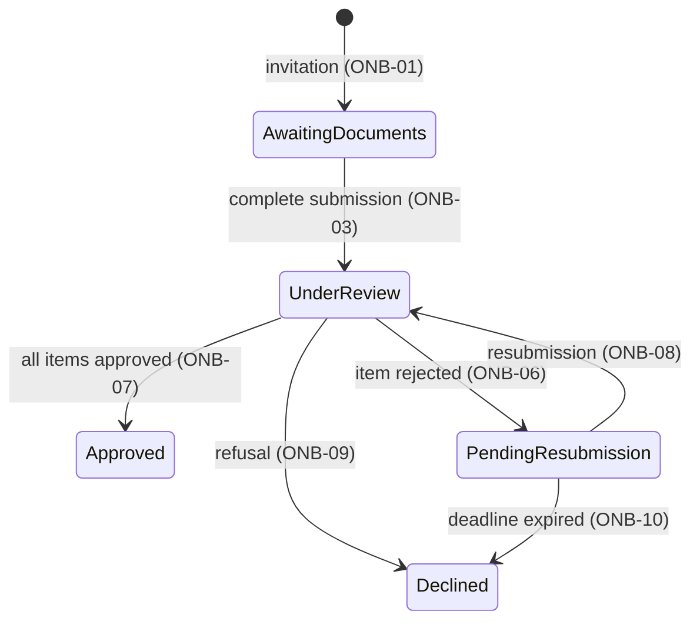

# Example PRD in the target format

Complete example of a single-context PRD, without PRD 0000. Read the corresponding section the first time, in this session, you write a section from the writing.md table; it is not a template to copy. The rules it applies are in writing.md. The numbers (lead time, percentages, deadlines) are illustrative. The normative references were read on the indicated date; the BCB Circular is tagged `[ASSUMPTION]` because the article was not checked in the text.

````markdown
# Asynchronous Document Verification for Onboarding

| | |
|---|---|
| **Originating Context** | Customer Onboarding; affects Account Activation, Compliance Review |

Requirement prefix: `ONB`. Single context, therefore there is no PRD 0000.

## Executive Summary

Onboarding of business customers depends on email exchanges between operations and compliance to verify documents, with a lead time of 5 business days and recurring rework due to non-standard submissions. The proposal replaces that exchange with a verification case with explicit state: submission happens without depending on compliance's schedule, each item is validated against a defined criterion and activation eligibility derives from the state of the case. The primary metric is the lead time from complete submission to activation within 1 business day.

## Strategic Alignment

Time-to-revenue is the quarter's objective. Competitors activate on D+1 and the verification bottleneck is the largest share of our lead time. Digitizing the flow is a precondition for the v2 self-service.

## Context and Problem

Verification is manual, done by email and spreadsheet between operations and compliance. The average lead time is 5 business days, and 30% of cases come back because of non-standard documents.

Account activation only happens after compliance approval, and today that approval is an email message with no structured record.

## Target User / JTBD

- Compliance analyst: validate each document against a defined criterion, with a trail, without coordinating by inbox.
- Onboarding operator: know where each customer stands and what is missing, without asking compliance.
- Account Activation (consuming context): know whether the customer is eligible for activation without interpreting emails.

## Proposed Solution

One verification case per customer, with items (one per required document) and an explicit state machine. The transition labels cite the requirement that governs each one.



| State | Identifier | Meaning |
|---|---|---|
| Awaiting documents | `AwaitingDocuments` | Active invitation; required items not yet fully submitted |
| Under review | `UnderReview` | All items submitted; compliance validates |
| Pending resubmission | `PendingResubmission` | At least one item rejected; only those accept resubmission |
| Approved | `Approved` | All items approved; eligible for activation; terminal |
| Declined | `Declined` | Compliance refusal or deadline expired; terminal |

Document storage, notification, queues and screen design are downstream.

## Domain Glossary

| Term | Definition |
|---|---|
| Verification case | The set of items required from a customer and the resulting state. One per customer per onboarding. |
| Item | One document required by the checklist, with its own state: pending, approved, rejected. |
| Checklist | List of items required per customer type. Defined by compliance (ONB-05). |
| Complete submission | The instant when every checklist item has a document attached (ONB-03). |
| Activation eligibility | Property derived from the state of the case (ONB-11); not an operator decision. |

## Functional Requirements

Each requirement is a verifiable condition.

### Submission

- **ONB-01 (Must)** Every case starts in Awaiting documents from an active invitation; there is no creation in another state.
- **ONB-02 (Must)** In v1 the onboarding operator submits the documents on behalf of the customer, at any time while the invitation is active, regardless of compliance's availability.
- **ONB-03 (Must)** The case moves to Under review the instant every checklist item has a document attached.
- **ONB-04 (Must)** The system rejects on the spot an item whose format or size does not meet the checklist and reports the violated criterion.

### Validation

- **ONB-05 (Must)** The checklist per customer type is defined by compliance and versioned; the case uses the version in force at the invitation.
- **ONB-06 (Must)** Rejecting an item requires a reason among the checklist criteria and moves the case to Pending resubmission.
- **ONB-07 (Must)** The case moves to Approved when every item is approved; Approved is terminal.
- **ONB-08 (Must)** In Pending resubmission, only rejected items accept resubmission; resubmission moves the case to Under review.
- **ONB-09 (Must)** Compliance may refuse a case in Under review with a recorded reason; Declined is terminal.
- **ONB-10 (Must)** A case in Pending resubmission for more than 10 business days moves to Declined with reason "deadline expired".

### Activation and audit

- **ONB-11 (Must)** Activation eligibility is true if and only if the case is Approved.
- **ONB-12 (Must)** Every submission, validation and transition records author, instant and reason, queryable by case and by customer.

## Non-functional Requirements

- **ONB-NFR-01** A complete submission is reflected as Under review within 1 minute.
- **ONB-NFR-02** Documents of a Declined case are retained for at most 30 days after the refusal, except for a legal retention obligation, which prevails for the period it sets.
- **ONB-NFR-03** Personal data does not appear in execution traces; case and item identifiers suffice.

## Regulatory Considerations

Texts read on 2026-09-05.

- [ASSUMPTION] BCB Circular 3.978/2020, art. 2: identification and qualification of the customer before the start of the relationship → ONB-05, ONB-11. Validate with compliance whether the current checklist covers qualification.
- LGPD, art. 15, I: processing ends when the purpose is achieved → ONB-NFR-02.
- LGPD, art. 16, I: retention allowed to comply with a legal obligation → exception to ONB-NFR-02.
- [GAP] Sector regulation beyond KYC and LGPD for the business segment was not surveyed; validate with compliance.

## Non-goals

- Onboarding of other segments (consumer, enterprise with a custom contract).
- Digital contract signature.
- Customer self-service for continuous registration updates.
- Reviewing the merit of the checklist rules.

## Declared Trade-offs

- **v1 without direct customer self-service (ONB-02).** *Cost:* operations remains an intermediary in the upload; human load partially preserved. *Reason:* validating the flow internally before exposing it reduces reputational and regulatory risk; self-service is v2.
- **Checklist modeled from the current process, without revisiting the merit.** *Cost:* a low-value legacy rule persists in the digital flow. *Reason:* revisiting the merit crosses the compliance boundary and expands scope; it is a separate initiative after the digital baseline.
- **Pending deadline fixed at 10 business days.** *Cost:* a slow customer is declined and needs a new invitation. *Reason:* an open-ended case would inflate the measured lead time and the compliance backlog.

## Success Metrics

- Leading: 80% of onboardings started through the new flow within 30 days; compliance response within 4 h after Under review.
- Lagging: lead time from complete submission to activation within 1 business day in 90% of cases after 60 days; zero rework due to non-standard documents.
- Guardrails: rejection rate in post-onboarding audit at or below baseline; support tickets opened by the customer during onboarding at or below baseline; effective review time stable (the gain comes from eliminating waiting, not from speeding up review).

## Acceptance Criteria

The scenarios assume a checklist with 3 items and a pending deadline of 10 business days.

| Case | Input | Intermediate | Branch | Result |
|---|---|---|---|---|
| Complete submission | 3 items attached at 10:00 | all within standard | ONB-03 | Under review by 10:01 (ONB-NFR-01) |
| Non-standard item | item 2 in a non-accepted format | violated criterion: format | ONB-04 | item refused on the spot; case stays Awaiting documents |
| Partial rejection | items 1 and 3 approved, 2 rejected | checklist reason | ONB-06 | Pending resubmission; only item 2 accepts resubmission (ONB-08) |
| Partial resubmission with two rejected | items 2 and 3 rejected, only 2 resubmitted | item 3 still rejected | ONB-08 | case moves to Under review with item 3 still rejected; resubmission of item 1 (approved) is not accepted |
| Approval | resubmission of item 2 approved | 3 of 3 approved | ONB-07 | Approved; eligibility true (ONB-11) |
| Deadline expired | Pending resubmission for 11 business days | no resubmission | ONB-10 | Declined, reason "deadline expired"; eligibility false |

- **Given** an Approved customer, **when** an auditor queries the history, **then** they see every submission, validation and transition with author, instant and reason (ONB-12).

## Dependencies and Risks

| Item | Type | Impact |
|---|---|---|
| Checklist definition per customer type | Business dependency | Blocking: without a checklist there is no case |
| Account Activation | Coupling between contexts | Reads eligibility; ONB-11 is the contract, and a state change without notice breaks activation |
| Compliance Review | Coupling between contexts | Receives the pending case; the review starts from the state this context publishes, and without it the compliance queue does not open |
| Migration of customers in onboarding | Risk | In-flight cases need an equivalent initial state |

## Open Questions

- **[ASSUMPTION] The lead time is caused by the manual exchange and the waiting, not by the complexity of the review; if false, the review remains costly after digitization, the gain is marginal and the initiative does not pay off.** Owner: operations. Resolved by measuring the effective review time in 20 cases before approving.
- Is there sector regulation beyond KYC and LGPD for the business segment that adds items to the checklist (ONB-05)? It is the `[GAP]` recorded in Regulatory Considerations. Owner: compliance. Resolved with a written opinion before approving.

## Weakest Point

The decision to **model the checklist from the current process without revisiting the merit of the rules**, recorded in Declared Trade-offs.

*Attack vector:* digitizing a bad manual process delivers a bad digital process, faster. If a relevant share of current rejections comes from a dispensable legacy rule, "zero rework" is not reachable without touching the merit, and deferring the review to a "separate initiative" protects the root cause.

*Challenge before approving:* is there evidence that the current checklist is mostly real value and not inherited ceremony? Without it, move a minimal merit triage into v1 or lower the rework goal until the digital baseline exists.

## References

- [BCB Circular 3.978/2020](https://www.bcb.gov.br/estabilidadefinanceira/exibenormativo?tipo=Circular&numero=3978), art. 2. Read on 2026-09-05.
- [Law 13.709/2018 (LGPD)](https://www.planalto.gov.br/ccivil_03/_ato2015-2018/2018/lei/l13709.htm), arts. 15 and 16. Read on 2026-09-05.
````

## Partial writing example

The didactic fragment below demonstrates style and does not enter the generated PRD.

```text
Didactic rewrite example; both sentences express the same behavior.

Before: In the event that a submission is made of an item whose format or
size does not meet the checklist, the rejection shall be carried out on the
spot together with the provision of information about the criterion that
was violated.

After: The system rejects on the spot an item whose format or size does not
meet the checklist and reports the violated criterion.

Preserved: rejection condition, moment of the response and information
returned. The normative definition of the complete example remains ONB-04.
```
